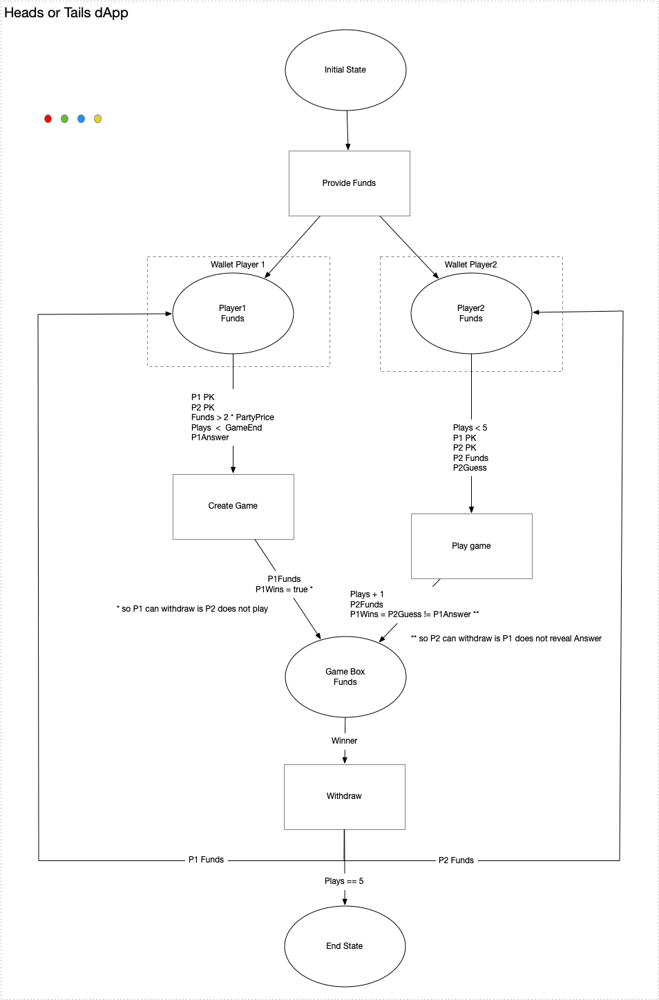
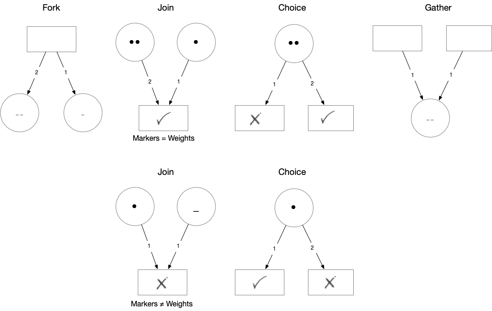

# Castanet, a Colored Petri Net for GRPC/HTTP orchestration and testing

## SBT configuration

```sbt
libraryDependencies += "xyz.didx" %% "castanet" % "0.1.9"
```

## Getting Started

Formally, a Petri Net is a state transition graph that maps Places (circles) to Transitions (rectangles) and Transitions to Places via Arcs (arrows).
It is well suited for describing the flow of concurrent processes.

Petri Nets are more concise than other process flow descriptions (like UML or BPMN) in that they have an exact mathematical definition of their execution semantics, with a well-developed mathematical theory for process analysis. Bounded Petri Nets exhibits Categorical Semantics in the way that **concatenable processes as strict Monoidal categories** model Net computations [[1]](#1) [[2]](#2)

Because of its Markov property - states depend only on the current marking -  Stochastic Petri Nets are also used for validating and testing the Liveness, Boundedness and Reachability of distributed networks.

From the Castanet perspective, Petri Nets are directed graphs consisting of Places(States), Transitions(Services) and Arcs(Guards). It models state-transitions of (concurrent) processes.
It is easy to see (if you are that way inclined) that Petri Nets form a Category of Petri  
Protobuf definitions specify the service and message format for GRPC services.
An GRPC/HTTP call is assumed to be stateless, yet often there is a need to have service calls handled within the context of a state machine (FSM)

Castanet constructs a PetriNet using a builder-pattern

```scala
    val start: Place = Place("start", 1)
    val left: Place  = Place("left", 3)
    val right: Place = Place("right", 1)
    val joint: Place = Place("joint", 3)
    val end: Place   = Place("end", 1)
    val s1 = Service(
      "xyz.didx.castanet",
      "HelloFs2Grpc",
      List[RPC](RPC(name = "sayHello", input = "", output = ""))
    )
    val r1 = s1.rpcs.head

    val splitter: Transition  = Transition("splitter", s1, r1)
    val joiner: Transition    = Transition("joiner", s1, r1)
    val continuer: Transition = Transition("continuer", s1, r1)

    val w1   = Weight(Colour.LIGHT_BLUE, 1)
    val w2   = Weight(Colour.LIGHT_BLUE, 1)
    val w3   = Weight(Colour.LIGHT_BLUE, 1)
    val w4   = Weight(Colour.LIGHT_BLUE, 2)
    val w5   = Weight(Colour.LIGHT_BLUE, 1)
    val w6   = Weight(Colour.LIGHT_BLUE, 1)
    val w7   = Weight(Colour.LIGHT_BLUE, 3)
    val w8   = Weight(Colour.LIGHT_BLUE, 1)
    val ptt1 = PlaceTransitionTriple(start, ListSet(w1), splitter, ListSet(w2), left)
    val ptt2 = PlaceTransitionTriple(start, ListSet(w2), splitter, ListSet(w3), right)
    val ptt3 = PlaceTransitionTriple(left, ListSet(w4), joiner, ListSet(w6), joint)
    val ptt4 = PlaceTransitionTriple(right, ListSet(w5), joiner, ListSet(w6), joint)
    val ptt5 = PlaceTransitionTriple(joint, ListSet(w7), continuer, ListSet(w8), end)

    val pn = PetriNetBuilder().add(ptt1).add(ptt2).add(ptt3).add(ptt4).add(ptt5).build()
```

State is attributed to the Petri Net through Markers that associate a BitVector (scodec.bits) with a specific Place.

```scala
    val m1 = Markers(pn)
    val m2 = m1.setMarker(Marker(start.id, bin"1"))
    val m3 = m2.setMarker(Marker(left.id, bin"1")).setMarker(Marker(joint.id, bin"11"))
    val m4 = Markers(pn, m3.toStateVector)
    val m5 = Markers(pn, m4.serialize)  
```



For a given set of Markers (current state) the PetriNet can be asked to step through to the next state (set of markers) as indicated by the guards placed on the Arcs that join Places and Transitions.

A ColouredPetriNet is traversable using a state monad to step from an initial state

The resulting state changes can be visualized with a PetriPrinter.

```scala
   PetriPrinter(fileName = "petrinet1", petriNet = pn).print(Option(m3))
    val steps: State[Step, Unit] =
      for
        p1 <- pn.step
        p2 <- pn.step
        p3 <- pn.step
      yield (
        PetriPrinter(fileName = "petrinet2", petriNet = pn).print(Option(p1)),
        PetriPrinter(fileName = "petrinet3", petriNet = pn).print(Option(p2)),
        PetriPrinter(fileName = "petrinet4", petriNet = pn).print(Option(p3))
      )
    steps.run(Step(m3, true, 1)).value
```

A business engineer can create a workflow by joining Places (States) and Transitions with Arcs 



## References

<a id="1">[1]</a>
Sassone, V.. (2006). On the category of Petri net computation. 10.1007/3-540-59293-8_205. 

<a id="2">[2]</a>
Ermel, Claudia & Martini, Alfio. (1996). A Taste of Categorical Petri Nets. 